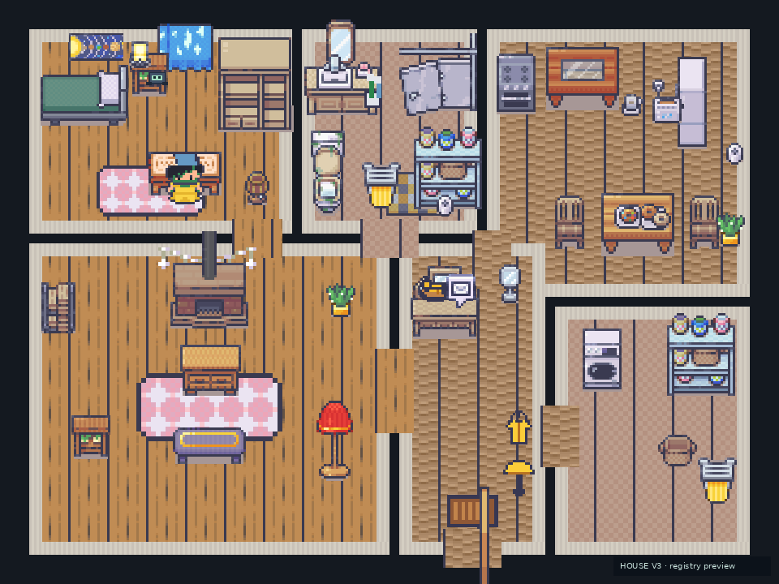

# House V3 — comparação visual

## Antes: composição de protótipo

A implementação anexada organizava a Casa em uma grade de grandes retângulos:

```text
QUARTO | BANHEIRO | COZINHA
SALA   | ENTRADA  | LAVANDERIA
```

Os móveis eram colocados diretamente em `HomeScene`, com grandes vazios, entrada/lavanderia superdimensionadas, rótulos permanentes e chave-emoji no chão. A composição transmitia “demonstração de assets”, não rotina doméstica.

## Depois: registro residencial compacto

- cama encostada à parede, acesso lateral, criado-mudo, luminária, armário e estudo;
- banheiro dividido em pia/espelho, chuveiro/toalha, vaso e armazenamento;
- cozinha em linha funcional com mesa/jantar conectada;
- sofá → mesa de centro → TV/rack como eixo da sala;
- hall reduzido com aparador, tigela/chaves, espelho, casaco, correspondência e porta;
- lavanderia compacta com máquina, cesto, detergente e secagem;
- objetos e colisões derivados do mesmo registro;
- labels somente no debug F3.



Crops técnicos por cômodo estão em `docs/_validation/layout/room-*.png`.

## Natureza das evidências

A imagem acima é produzida diretamente da definição de layout/objetos e serve para revisar densidade, posição, colisões e circulação. Ela **não é apresentada como screenshot do Phaser**. O ambiente não conseguiu instalar Phaser/Vite/Playwright por falha de DNS e o projeto recebido não tinha lockfile. Portanto, `screenshots/before/` e `screenshots/after/` permanecem com `.gitkeep` em vez de arquivos falsos.

## Capturas reais preparadas

A suíte Playwright está estruturada para produzir, quando dependências forem instaladas:

- full-house, bedroom, bathroom, kitchen, living-room, entry e laundry;
- movimento em quatro direções;
- sitting, lying, sleeping e shower;
- breakfast, inventory, phone, dialogue e debug-layout;
- fluxos de manhã, noite, persistência, navegação e idioma.

A aceitação visual final ainda exige abrir o preview real, revisar console/network e comparar essas capturas com a referência publicada.
