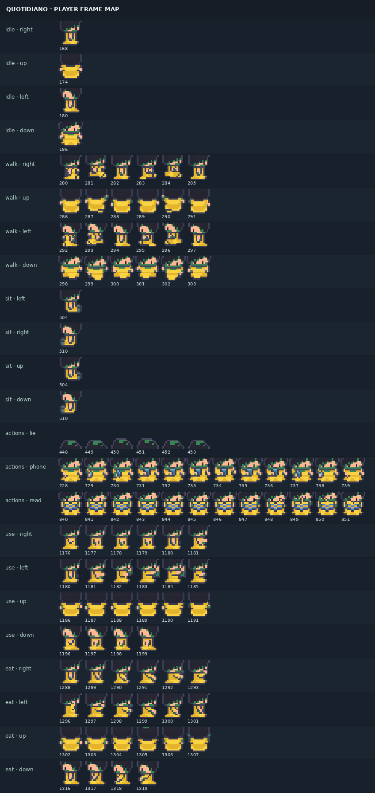
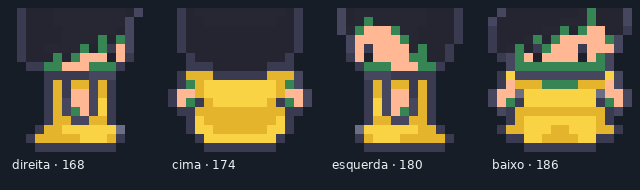

# House V3 — mapa de frames do protagonista

Spritesheet: `public/assets/runtime/characters/player_quotidiano.png`, frames de 48×48, 2.296 frames válidos.

## Direções corrigidas

| Direção lógica | Movimento | Idle | Walk | Aparência esperada |
| --- | --- | ---: | --- | --- |
| `up` | Y negativo | 174 | 286–291 | costas |
| `down` | Y positivo | 186 | 298–303 | frente |
| `left` | X negativo | 180 | 292–297 | perfil esquerdo |
| `right` | X positivo | 168 | 280–285 | perfil direito |

A baseline usava os blocos laterais invertidos e um idle direito intermediário. O mapa agora é centralizado em `src/game/entities/playerFrameMap.ts`; `Player.ts` não possui números de direção espalhados.

## Ações selecionadas

| Ação | Frames |
| --- | --- |
| sentar | 504/510 conforme direção |
| deitar/dormir | 448–453 |
| telefone | 728–739 |
| ler | 840–851 |
| usar/lavar/cozinhar | 1176–1199 conforme direção |
| comer/beber | 1288–1319 conforme direção |

`Player.playAction()` usa sequências existentes e retorna ao idle da última direção quando a ação termina. `Player.snapshot()` persiste `facing`; a restauração preserva a orientação quando o estado salvo é seguro.

## Evidência visual de inspeção

- `docs/_validation/player-contacts/player-frame-map.png`
- `docs/_validation/player-contacts/player-idle-directions.png`
- `tools/sprite-frame-inspector/`





## Inspetor local

Após instalar dependências:

```bash
npm run sprite-inspector
```

A ferramenta permite navegar por índice, testar intervalos e variar velocidade. O teste offline valida que todos os frames declarados estão dentro da spritesheet, que as quatro direções são distintas e que os blocos de caminhada possuem seis frames.
